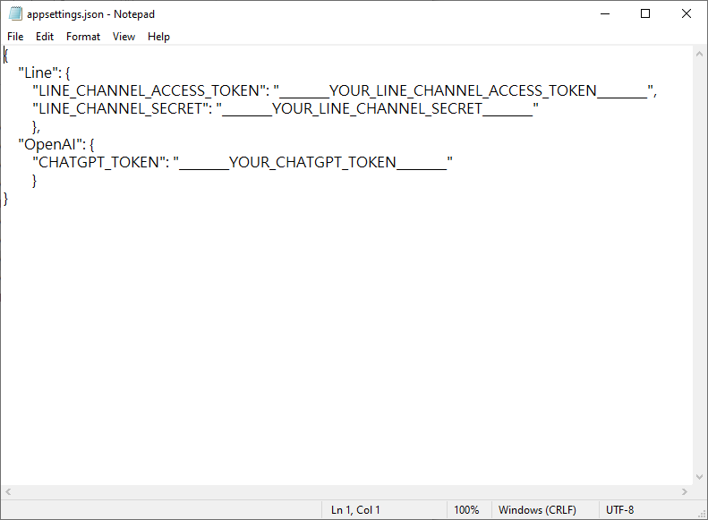

# Python-ChatGPTLineBot

## **Installation**

### **Git Clone** Command

1. Open Git Bash.
2. Clone.
    
    ```bash
    # 複製 git 到本地
    git clone https://github.com/HoningLo/Python-ChatGPTLineBot.git
    cd Python-ChatGPTLineBot
    ```
    

### **Requirements**

- Python >= 3.7

```bash
pip install -r requirements.txt
```

## Configuration

Open the **.env** file and update the configuration values it contains to reflect the `OUR_LINE_CHANNEL_ACCESS_TOKEN`, `YOUR_LINE_CHANNEL_SECRET` and `YOUR_CHATGPT_TOKEN` for your cognitive services resource. Save your changes.



## Execute

```bash
python main.py
```

## Use NGROK

Download Link: [ngrok - download](https://ngrok.com/download)

```bash
# Add authtoken
ngrok config add-authtoken <token>

# Start a tunnel
ngrok.exe http 5000
```


## Configure LINE WebHooks

Copy `https URL`.


Paste Your `<https URL>/callback` before verifying.


Verification successful.


# Reference

[isdaviddong/chatGPTLineBot (github.com)](https://github.com/isdaviddong/chatGPTLineBot)

[https://beta.openai.com/docs/api-reference/completions/create](https://beta.openai.com/docs/api-reference/completions/create)

[line/line-bot-sdk-python: LINE Messaging API SDK for Python (github.com)](https://github.com/line/line-bot-sdk-python)

[ngrok - Online in One Line](https://ngrok.com/)